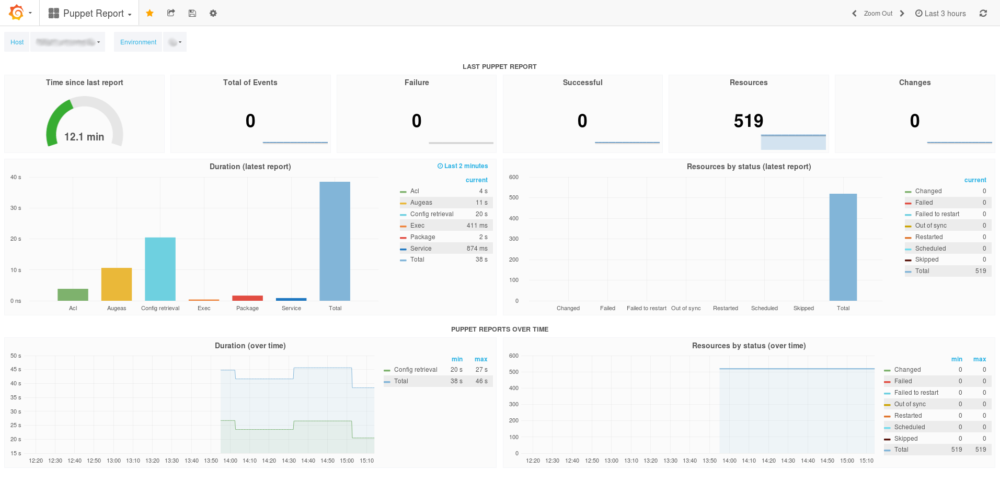

# Grafana Puppet dashboards (Prometheus datasource)

This repository contains a [Grafana](http://grafana.org/) dashboard that can be
used for monitoring Puppet reports metrics.

It is meant to be used with the Puppet
[prometheus_reporter](https://github.com/voxpupuli/puppet-prometheus_reporter).

## Dashboards

### Puppet

Deep dive one node's Puppet reports

### Puppet Overview

Get an overview of all Puppet nodes reports

## How to

### Puppet & Prometheus setup

See [prometheus_reporter](https://github.com/voxpupuli/puppet-prometheus_reporter).

### Grafana

The dashboards expects a datasource called Prometheus (in line with
[percona/grafana-dashboards](https://github.com/percona/grafana-dashboards)
recommendations).

## Contributors

[See Github](https://github.com/voxpupuli/grafana-dashboards-puppet-prometheus/graphs/contributors).

Special thanks to [Vox Pupuli](https://voxpupuli.org) to provide a platform
that allows us to develop of the dashboards.

## Copyright and License

Copyright © 2016 [Multiple contributors][mc]

[mc]:https://github.com/voxpupuli/grafana-dashboards-puppet-prometheus/graphs/contributors

Licensed under the Apache License, Version 2.0 (the "License");
you may not use this file except in compliance with the License.
You may obtain a copy of the License at

  http://www.apache.org/licenses/LICENSE-2.0

Unless required by applicable law or agreed to in writing, software
distributed under the License is distributed on an "AS IS" BASIS,
WITHOUT WARRANTIES OR CONDITIONS OF ANY KIND, either express or implied.
See the License for the specific language governing permissions and
limitations under the License.

